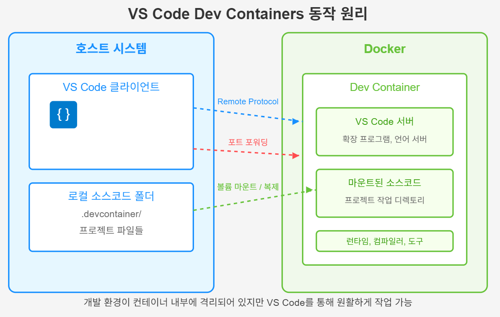

오늘은 개발자들의 삶을 훨씬 편리하게 만들어주는 강력한 도구인 VS Code의 Dev Container에 대해 알아보려고 합니다.

# Dev Container란 무엇인가요?
개발을 하다보면 이런 상황들을 한 번쯤은 겪어보셨을 겁니다.
- "내 컴퓨터에서는 잘 돌아가는데 왜 다른 사람 컴퓨터에서는 안 돌아가지?"
- "이 프로젝트 시작하려면 환경 설정이 너무 복잡해..."
- "팀원마다 다른 버전의 도구를 쓰고 있어서 버그가 자꾸 발생해..."

Dev Containers는 이런 문제들을 해결하기 위해 등장한 Visual Studio Code의 확장 기능입니다. 간단히 말해, 프로젝트의 개발 환경을 컨테이너(Docker)로 격리하여 어디서든 동일한 환경에서 개ㅏㄹ할 수 있게 해주는 도구입니다.

# Dev Containers의 핵심 개념
컨테니어라는 개념이 생소하시다면, 작은 가상 컴퓨터라고 생각하시면 됩니다. 이 작은 컴퓨터 안에서는 프로젝트를 개발하는데 필요한 모든 도구와 설정정이 이미 준비되어 있습니다.

Dev Container의 핵심은 다음과 같습니다
1. 격리된 환경: 로컬 시스템에 영향을 주지 않고 프로젝트에 필요한 도구와 라이브러리를 설치할 수 있습니다.
2. 일관된 개발 경험: 모든 팀원이 정확이 동일한 환경에서 개발할 수 있습니다.
3. 간편한 설정: 새로운 팀원이 합류했을 때 복잡한 환경 설절 없이 바로 개발을 시작할 수 있습니다.
4. VS Code 통합: 컨테이너 안에서 개발하지만, 익숙한 VS Code 인터페이스와 확장 기능을 그대로 사용할 수 있습니다.

# Dev Containers는 어떻게 동작하나요?
Dev Containers의 동작 원리를 간단히 설명하면 다음과 같습니다
1. 정의: 프로젝트에 `.devcontainer` 폴더를 만들고, 그 안에 개발 환경 설정을 정의합니다.
2. 빌드: VS Code가 이 설정을 바탕으로 Docker 컨테이너를 생성합니다.
3. 연결: VS Code가 컨테이너 내부에 설치된 VS Code 서버와 연결됩니다.
4. 개발: 개발자는 로컬에서 VS Code를 사용하는 것처럼 개발하지만, 실제로는 컨테이너 안에서 코드가 실행됩니다.

## 주요 구성 요소

### 1. 호스트 시스템
- VS Code 클라이언트: 개발자가 직접 상호작용하는 에디터 인터페이스
- 로컬 소스코드 폴더: 프로젝트 파일과 .devcontainer 설정이 포함된 디렉토리
### 2. Docker 환경
- Dev Container: 격리된 개발 환경을 제공하는 Docker 컨테이너
- VS Code 서버: 클라이언트와 통신하며 컨테이너 내부에서 실행
- 마운트된 소스코드: 호스트의 코드를 컨테이너 내부에서 사용 가능하게 함
- 개발 도구: 언어 런타임, 컴파일러 등 개발에 필요한 도구들

### 3. 연결 메커니즘
- Remote Protocol: VS Code 클라이언트와 서버 간의 통신
